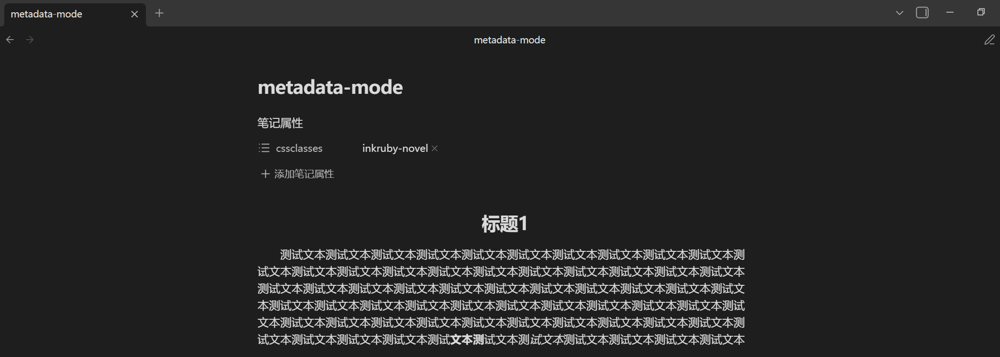
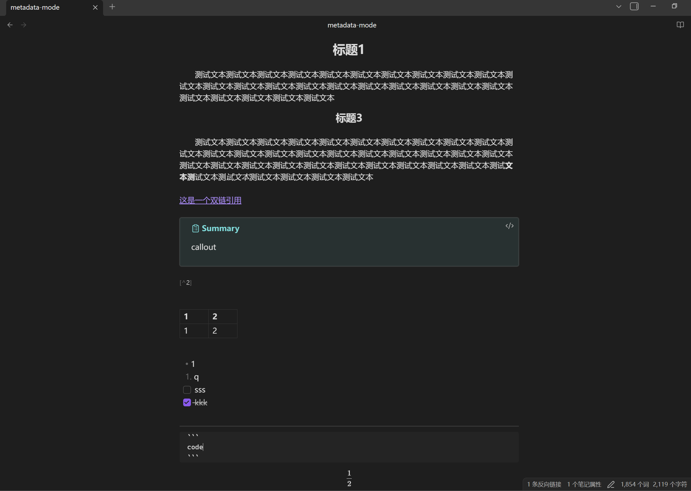

# 墨注（InkRuby） - Obsidian 诗词古文渲染插件  
InkRuby — Obsidian Plugin for Rendering Ancient Chinese Poetry & Literary Chinese

## 简介 Introduction
墨注（InkRuby） 是一个 Obsidian 插件，用于渲染诗词与古文样式和将markdown文件当小说来阅读。它通过指定代码块，为文本添加拼音标注和行间注释，将其渲染成简单的古诗文样式，也可通过添加指定笔记属性的值来将markdown文件当作小说来阅读。  

InkRuby (墨注) is an Obsidian plugin for rendering classical Chinese poetry and prose styles and for reading markdown files as novels. It renders text into a simple classical poetry style by using designated code blocks to add pinyin annotations and interlinear comments, and it can also enable reading markdown files as novels by adding a specified note property value.

## 功能特性 Features

 - **双代码块标识符支持**：支持 `poetry`（诗歌）与 `lc`（文言文`Literary Chinese`的首字母缩写，同时支持大写 `LC`）两种代码块模式。  
**Dual Code Block Identifiers**: Supports two modes: `poetry` (for poetry) and `lc` (short for Literary Chinese; uppercase `LC` is also supported).

- **拼音标注**：使用 `**字pīnyīn**` 格式，自动将正文中的单个汉字与拼音转换为标准的 HTML `<ruby>` 标签。  
**Pinyin Annotation**: Uses the `**characterpīnyīn**` format to automatically convert individual Chinese characters and their pronunciations into standard HTML `<ruby>` tags.
  
- **双下划线注释**：使用 `==文本|注释==` 格式，为正文文本添加双下划线，鼠标悬浮即可显示注释。  
**Double Underline Annotation**: Uses the `==text|annotation==` format to add a double underline to text, displaying the annotation when hovered over with the mouse.

- **小说阅读模式**：在笔记属性 `cssclasses` 添加属性值 `inkruby-novel` ，即可将标题居中，普通段落首行缩进2个中文字符  
**Novel Reading Mode**：Add the property value `inkruby-novel` to the `cssclasses` note property to center titles and indent the first line of regular paragraphs by 2 Chinese characters.

---

## 使用方法 Usage Instructions
<br/>

>[!IMPORTANT]
>标题及作者不支持注音和行间注释  
>Titles and authors do not support phonetic notation or interlinear annotations.
>
>标题和作者应该分别位于代码块的第一和第二行  
>The title and author should be placed on the first and second lines of the code block, respectively.
>
>如果作者名不详，可用佚名代替作者名  
>If the author is unknown, you may use "佚名" (Anonymous) as a placeholder.

### 1. 诗歌模式 (`poetry`)  Poetry Mode (`poetry`)

<br/>

````markdown
```poetry
静夜思
李白
床前明月光，疑是地上霜。
举头望明月，低头思故乡。
```
````


### 2. 古文模式 (`lc` 或 `LC`)  Literary Chinese Mode (`lc` or `LC`)
<br/>

````markdown
```lc
滕王阁序（节选）
王勃
时维九月，序属三秋。潦水尽而寒潭清，烟光凝而暮山紫。俨骖騑于上路，访风景于崇阿。临帝子之长洲，得天人之旧馆。层峦耸翠，上出重霄；飞阁流丹，下临无地。鹤汀凫渚，穷岛屿之萦回；桂殿兰宫，即冈峦之体势。
```

```LC
滕王阁序（节选）
王勃
时维九月，序属三秋。潦水尽而寒潭清，烟光凝而暮山紫。俨骖騑于上路，访风景于崇阿。临帝子之长洲，得天人之旧馆。层峦耸翠，上出重霄；飞阁流丹，下临无地。鹤汀凫渚，穷岛屿之萦回；桂殿兰宫，即冈峦之体势。
```
````

<br/>

代码块标识符`lc`和`LC`均是一样的效果  
Both `lc` and `LC` produce the same effect.  

<br/>


### 3. 拼音标注 Pinyin Annotation

<br/>

在代码块内部使用 `**字pinyin**` 的格式。  
Use the `**字pīnyīn**` format within the code block.

<br/>

````markdown
```poetry
忆秦娥·娄山关
毛泽东 1935年

**西xī**风**烈liè**，长空雁叫**霜shuāng****晨chén**月。
**霜shuāng****晨chén**月，马蹄声**碎suì**，**喇lǎ**叭声**咽yè**。

雄关**漫màn**道真如**铁tiě**，而今**迈mài**步从头**越yuè**。
从头**越yuè**，**苍cāng**山如海，**残cán**阳如**血xuè**。
```
````

<br/>


<br/>

### 4. 双下划线注释  Double Underline Annotation

<br/>

使用 `==文本|注释==` 格式添加悬浮注释。  
Use the `==text|annotation==` format to add hover annotations.

<br/>

````markdown
```lc
岳阳楼记（节选）
范仲淹
庆历四年春，滕子京谪守巴陵郡。越明年，政通人和，百废俱兴。
==**衔xián****远yuǎn**山|衔接远处群山==，吞长江，浩浩汤汤，横无际涯；朝晖夕阴，气象万千。此则岳阳楼之大观也。
```

```poetry
忆秦娥·娄山关
毛泽东 1935年

**西xī**风**烈liè**，长空雁叫**霜shuāng****晨chén**月。
**霜shuāng****晨chén**月，马蹄声**碎suì**，**喇lǎ**叭声**咽yè**。
```
````

<br/>


<br/>

### 小说阅读模式 Novel Reading Mode

<br/>

通过将markdown文件的标题居中，段落首行缩进2个中文字符从而达到将markdown文件当成一本小说来阅读。  
By centering the titles of the markdown file and indenting the first line of each paragraph by 2 Chinese characters, the markdown file can be read like a novel.

<br/>

#### 在文件上启用 Enabling on a File

<br/>

在markdown文件首行添加笔记属性值为 `inkruby-novel` 的 `cssclasses` 属性  
Add a `cssclasses` property with the value `inkruby-novel` to the front matter at the very beginning of the markdown file.

在obsidian文件的首行添加三条短横线 `---` 即可被obsidian自动识别并生成笔记属性,然后添加属性 `cssclasses` 并将其值设置为 `inkruby-novel`   
Add three dashes `---` at the very first line of the Obsidian file, which will be automatically recognized and generate the note properties; then add the property `cssclasses` and set its value to `inkruby-novel` .

<br/>



<br/>

>[!tip]
>文件首行的三条短横线 `---` 之前不要有空格或其他字符  
>Do not place spaces or other characters before the three dashes `---` at the start of the file.
>
>不想启用了，将 `inkruby-novel` 删除即可；至于笔记属性，请根据你的实际需要来决定是否保留  
>If you no longer want this mode enabled, simply delete `inkruby-novel` ; as for the note properties, decide whether to keep them based on your actual needs.
>
>编辑视图中，光标所在的正在编辑的段落不会生效，不正在编辑的段落才生效  
>In the editing view, the paragraph where the cursor is currently placed will not take effect; only paragraphs that are not being edited will take effect.


<br/>

#### 效果展示 Effect Demonstration

<br/>

只对双链、callout、脚注、表格、列表、任务列表、代码块、公式简单试了一下是否对其语法效果产生影响  
A simple test was performed on wikilinks, callouts, footnotes, tables, lists, task lists, code blocks, and formulas to see if it affects their syntax or rendering.

<br/>



---

## 安装方法 Installation Guide

### 手动安装 Manual Installation
- 在[Release](https://github.com/BitFlood/inkruby/releases)中将`main.js`、`manifest.json`、`styles.css`文件复制并保存到你的计算机中名为`inkruby`的文件夹（如没有请自行创建）  
Copy the `main.js`, `manifest.json`, `styles.css` files from [Release](https://github.com/BitFlood/inkruby/releases) and save them into a folder named `inkruby` on your computer (create the folder if it doesn't already exist).


- 将`inkruby`文件夹放入你的 Obsidian 库路径的插件文件夹中：`你的obsidian库名/.obsidian/plugins/`。  
Place the `inkruby` folder into your Obsidian vault's plugins directory: `YourVaultName/.obsidian/plugins/`.

- 在 Obsidian 设置中启用 `InkRuby` 插件。  
Enable the `InkRuby` plugin in Obsidian's settings.

---

## 权限与隐私 Permissions and Privacy

此插件无需任何任何访问网络的权限，也无此功能。  
This plugin does not require any network access permissions, nor does it have such functionality.  

此插件仅在设备上本地运行  
This plugin runs locally on the device.  

此插件仅有对特定格式的文本进行美化样式的功能  
This plugin only has the function of beautifying the style of text in specific formats.

---

## 使用的开源协议 License
[MIT License](https://choosealicense.com/licenses/mit/)
