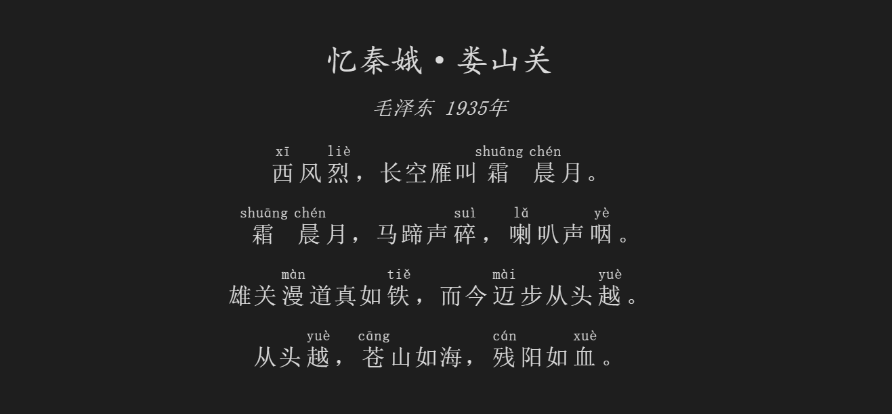
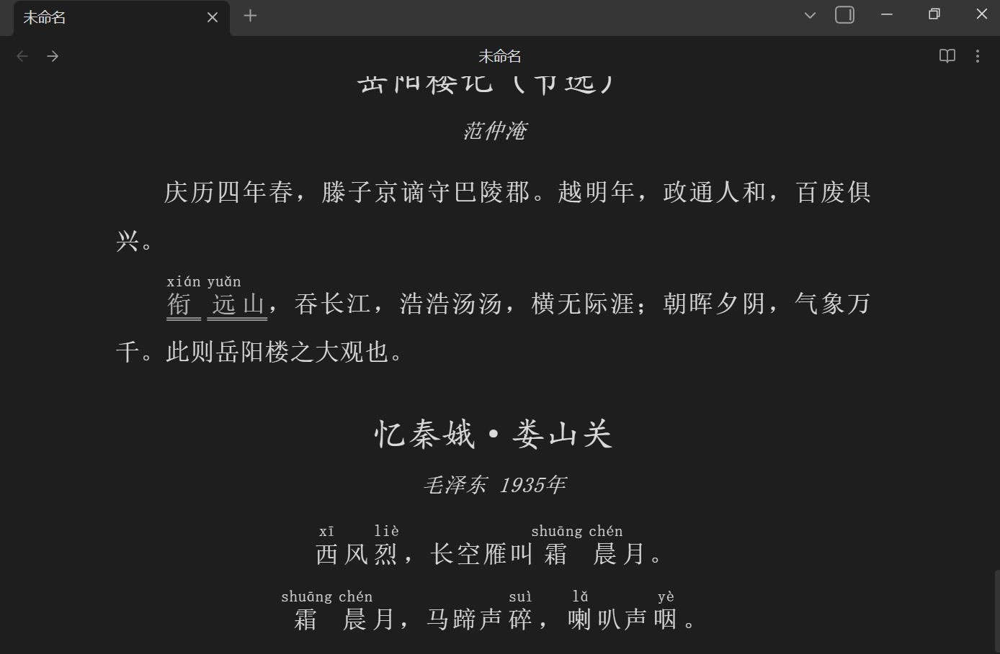

# 墨注（InkRuby） - Obsidian 诗词古文渲染插件
# InkRuby — Obsidian Plugin for Rendering Ancient Chinese Poetry & Prose

## 简介
## Introduction
墨注（InkRuby） 是一款为 Obsidian 设计的插件，用于渲染诗词与古文样式。它通过指定代码块，为文本添加拼音标注和行间注释。
InkRuby is an Obsidian plugin designed to render the styling of ancient Chinese poetry and prose. By using designated code blocks, it adds Pinyin annotations and interlinear notes to text.

## 功能特性
## Features
- **双代码块标识符支持**：支持 `poetry`（诗歌）与 `lc`（文言文`Literary Chinese`的首字母缩写，同时支持大写 `LC`）两种代码块模式。
- **Dual Code Block Identifiers**: Supports two modes: `poetry` (for poetry) and `lc` (short for Literary Chinese; uppercase `LC` is also supported).
- **拼音标注**：使用 `**字pīnyīn**` 格式，自动将正文中的单个汉字与拼音转换为标准的 HTML `<ruby>` 标签。
- **Pinyin Annotation**: Uses the `**characterpīnyīn**` format to automatically convert individual Chinese characters and their pronunciations into standard HTML `<ruby>` tags.
- **双下划线注释**：使用 `==文本|注释==` 格式，为正文文本添加双下划线，鼠标悬浮即可显示注释。
- **Double Underline Annotation**: Uses the `==text|annotation==` format to add a double underline to text, displaying the annotation when hovered over with the mouse.

## 使用方法
## Usage Instructions

- 标题及作者不支持注音和行间注释
- Titles and authors do not support phonetic notation or interlinear annotations.
- 标题和作者应该分别位于代码块的第一和第二行
- The title and author should be placed on the first and second lines of the code block, respectively.
- 如果作者名不详，可用佚名代替作者名
- If the author is unknown, you may use "佚名" (Anonymous) as a placeholder.

### 1. 诗歌模式 (`poetry`)
### 1. Poetry Mode (`poetry`)

````markdown
```poetry
静夜思
李白
床前明月光，疑是地上霜。
举头望明月，低头思故乡。
```
````


### 2. 古文模式 (`lc` 或 `LC`)
### 2. Literary Chinese Mode (`lc` or `LC`)

````markdown
```lc
滕王阁序（节选）
王勃
时维九月，序属三秋。潦水尽而寒潭清，烟光凝而暮山紫。俨骖騑于上路，访风景于崇阿。临帝子之长洲，得天人之旧馆。层峦耸翠，上出重霄；飞阁流丹，下临无地。鹤汀凫渚，穷岛屿之萦回；桂殿兰宫，即冈峦之体势。
```

```LC
滕王阁序（节选）
王勃
时维九月，序属三秋。潦水尽而寒潭清，烟光凝而暮山紫。俨骖騑于上路，访风景于崇阿。临帝子之长洲，得天人之旧馆。层峦耸翠，上出重霄；飞阁流丹，下临无地。鹤汀凫渚，穷岛屿之萦回；桂殿兰宫，即冈峦之体势。
```
````

`lc`和`LC`均是一样的效果


### 3. 拼音标注
### 3. Pinyin Annotation
在代码块内部使用 `**汉字拼音**` 的格式。
Use the `**characterpīnyīn**` format within the code block.

````markdown
```poetry
忆秦娥·娄山关
毛泽东 1935年

**西xī**风**烈liè**，长空雁叫**霜shuāng****晨chén**月。
**霜shuāng****晨chén**月，马蹄声**碎suì**，**喇lǎ**叭声**咽yè**。

雄关**漫màn**道真如**铁tiě**，而今**迈mài**步从头**越yuè**。
从头**越yuè**，**苍cāng**山如海，**残cán**阳如**血xuè**。
```
````



### 4. 双下划线注释
### 4. Double Underline Annotation
使用 `==文本|注释==` 格式添加悬浮注释。
Use the `==text|annotation==` format to add hover annotations.

````markdown
```lc
岳阳楼记（节选）
范仲淹
庆历四年春，滕子京谪守巴陵郡。越明年，政通人和，百废俱兴。
==**衔xián****远yuǎn**山|衔接远处群山==，吞长江，浩浩汤汤，横无际涯；朝晖夕阴，气象万千。此则岳阳楼之大观也。
```

```poetry
忆秦娥·娄山关
毛泽东 1935年

**西xī**风**烈liè**，长空雁叫**霜shuāng****晨chén**月。
**霜shuāng****晨chén**月，马蹄声**碎suì**，**喇lǎ**叭声**咽yè**。
```
````



## 安装方法
## Installation Guide

### 手动安装
### Manual Installation
- 在`Release`中将`main.js`、`mainifest.json`、`styles.css`文件复制到名为`inkruby`的文件夹
- Copy the files main.js, manifest.json, and styles.cssfrom the Releaseinto a folder named inkruby.
	
- Copy the files `main.js`, `manifest.json`, and `styles.css` into a folder named `inkruby`.
- 将`inkruby`文件夹放入你的 Obsidian 库路径的插件文件夹中：`你的obsidian库名/.obsidian/plugins/`。
- Place the `inkruby` folder into your Obsidian vault's plugins directory: `YourVaultName/.obsidian/plugins/`.
- 在 Obsidian 设置中启用 `InkRuby` 插件。
- Enable the `InkRuby` plugin in Obsidian's settings.

## 许可证
## License
MIT License